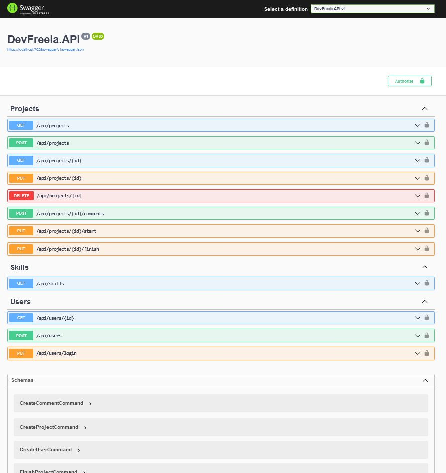

## API for Freelance Developers 🖥

#### *DevFreela was developed with clean architecture, repository pattern and CQRS.* 
#### *DevFreela has the purpose to offer projects and available labor regarding development.* 

### Technologies ⌨
- ASP.NET Core 8
- Entity Framework Core
- SQL Server
- Authentication and Authorization with JWT Bearer
- Unity tests: XUnit
- Fluent Validation

### Functionalities ⚙
- User registration for Client.
- User registration for Freelancer.
- User login using authentication and authorization.
- CRUD (Create, Read, Update, Delete) of Projects.
- Client has permissions to create, edit and delete the project.
- Add comments to the project: Client and Freelancers can communicate about the project progress through comments.
- Project status: Start and Finish
- Client can change the project status.

### Patterns, concepts and architecture 📂
- Clean Architecture
- CQRS
- Repository pattern

## Photos 📷

End Point Screen: 

<a href="https://www.linkedin.com/in/caiopgaspar/">Caio Henrique Pessoa Gaspar</a>
